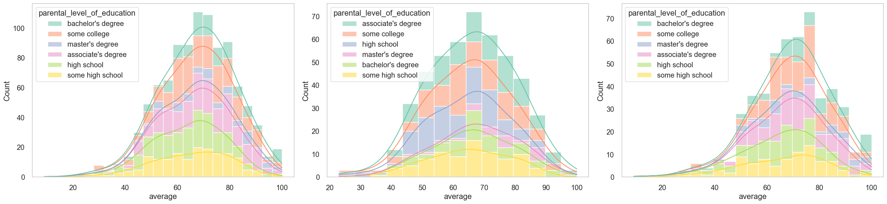
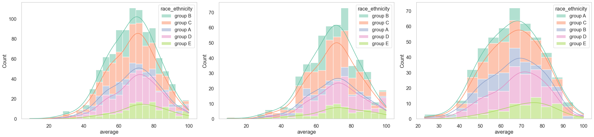
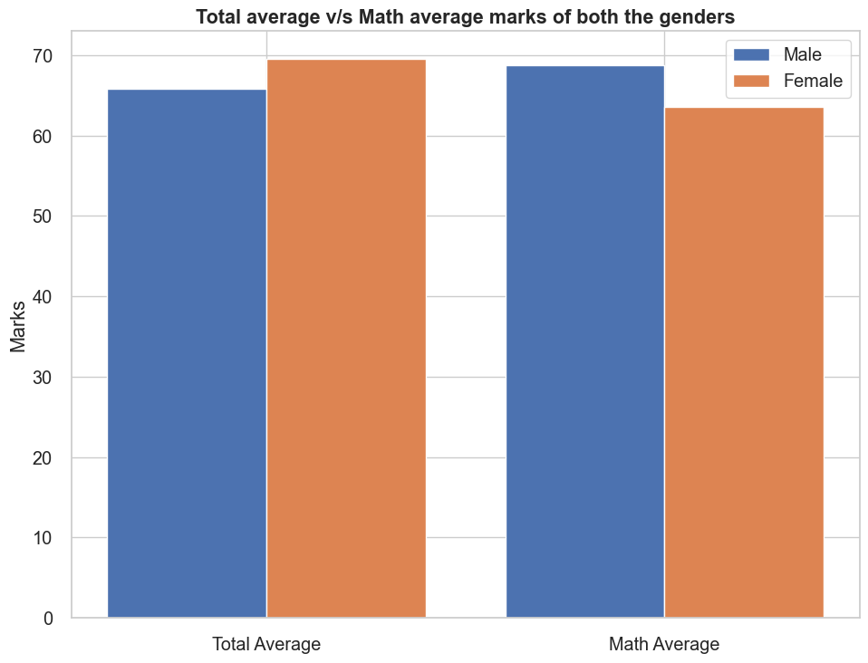
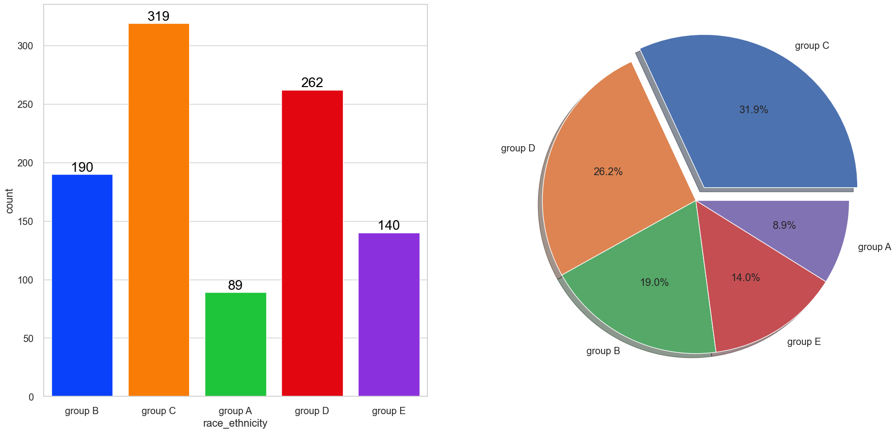

# 1. Project Name

Analysis of student's performance data.

# 2. Description

This project understands how the student's performance (test scores) is affected by other variables such as Gender, Ethnicity, Parental level of education, Lunch and Test preparation course.

# 3. Requirement

Stuent's Performance Analysis - **Project Requirements**

**Overview:** This document outlines the requirements for a project involving the analysis of the Students's test score dataset. The aim of this project is to demonstrate data analysis and visualization skills, as well as to create a portfolio piece for showcasing on Github.

The following questions will be answered through the analysis:

1. Visualize the distribution of average scores to draw conclusions.

2. Find the highest total score for students across all three subjects.

3. Visualize the distribution of lunch across the datset.

4. Visualize the distribution of gender and parental level education across the dataset.

5. Visualize group wise distribution for better comprehension.

6. Find the maximum score range of students in all  three subjects.

7. Anlayse columns - gender, lunch, test preparation, parental level education.

8. Visualize gender distribution.

9. Does gender any impact on student's performance.

10. Analyze race/ethnicity distribution.

11. Analyze if race/ethnicity has any effect on student's performance.

12. Investigate the educational background of student's parents.

13. Assess if parental education has any impact on student's performance.

14. Analyze which type of lunch is most commonly consumed by students.

15. Explore the effect of lunch type on student's results.

16. Examine the effect of test preparation course on student's performance.

17. Visualize multivariate analysis to gain deeper insights.

**Data Requirements**

- Dataset Source - https://www.kaggle.com/datasets/spscientist/students-performance-in-exams?datasetId=74977

**Analysis Requirements**

- The analysis should include all the necessary steps to answer the 17 questions listed above.

- Data visualization should be used to represent the findings, such as plotting graphs and charts.

**Deliverables**

- A code editor, such as VS Code, details the data analysis process, including the code and visualizations that are generated during the analysis.

- A GitHub repository containing the project files, including the VS Code, and any additional files required for the project.

**Timeline**

- The project should be completed within 3 weeks of the project start date – 07-July-2024

**Resources**

- Allocate at least 5 hours per week for working on the project.

# 4. Installation

To get started with the project, it is necessary to select and install a code editor that supports Python. VS Code is the editor we used in this project, and can be downloaded from Microsoft's website at https://code.visualstudio.com/.

# 5. Pre-requisites

You need to have the following packages installed for this project: pandas, numpy, matplotlib, seaborn, and warnings. Use the following commands to install them:

Code:

```bash
pip install pandas
pip install numpy
pip install matplotlib
pip install seaborn
pip install warning
pip install typing
pip install IPython
```

# 6. Analysis Findings

**Introduction**

In this project, Python will be used to analyze a student's performance dataset, with a focus on factors such as parental education, race/ethnicity, test preparation course, and lunch. The goal is to gain a better understanding of the relationship between these factors and academic performance.

**Results**

1.**Average score distribution**: Based on average score distribution - female students tend to perform well than male students.


2.**Total score distribution**: Based on average score and total score distribution - female students tend to perform well than male students.


3.**Lunch wise distribution**: Standard lunch helps perform well in exams irrespective of gender.


4.**Gender and parental level education distribution**: 

- In general parent's education don't help student perform well in exam.

- 2nd plot shows that parent's whose education is of associate's degree or master's degree their male child tend to perform well in exam

- 3rd plot we can see there is no effect of parent's education on female students.



5.**Group distribution**: 

- Students of group A and group B tends to perform poorly in exam.

- Students of group A and group B tends to perform poorly in exam irrespective of whether they are male or female.



6.**Maximum score range of students in all three subjects**:

- From the above three plots its clearly visible that most of the students score in between 60-80 in Maths whereas in reading and writing most of them score from 50-80


7.**Multivariate analysis**: 

- Number of Male and Female students is almost equal.

- Number of students are the highest in Group C.

- Number of students who have standard lunch are greater.

- Number of students who have not enrolled in any test preparation course is greater.

- Number of students whose parental education is "Some College" is greater followed closely by "Associate's Degree".


8.**Gender distribution**: Gender has balanced data with female students are 518 (48%) and male students are 482 (52%)


9.**Gender has any impact on student's performance**: 

- On an average females have a better overall score than men.

- whereas males have scored higher in Maths.



10.**Race/Ethnicity distribution**: 

- Most of the student belonging from group C /group D.

- Lowest number of students belong to groupA.



11.**Race/Ethnicity has any impact on student's performance**: 

- Group E students have scored the highest marks.

- Group A students have scored the lowest marks.

- Students from a lower Socioeconomic status have a lower avg in all course subjects


12.**Parental level education Distribution**: Largest number of parents are from some college.


13.**Parental education has any impact on student's performance**: The score of student whose parents possess master and bachelor level education are higher than others.


14.**Lunch wise distribution**: Students being served Standard lunch was more than free lunch.


15.**Lunch type intake has any impact on student's performance**: Students who get Standard Lunch tend to perform better than students who got free/reduced lunch.

  

16.**Has test preparation any impact on results**: Students who have completed the Test Prepration Course have scores higher in all three categories than those who haven't taken the course.


17.**Multivariate analysis**: From the below plot it is clear that all the scores increase linearly with each other.


# 7. Conclusions

Through this analysis, several insights were gained regarding the relationship between student performance and various factors. Key findings include:

- Student's Performance is related with lunch, race, parental level education

- Females lead in pass percentage and also are top-scorers

- Student's Performance is not much related with test preparation course

- Finishing preparation course is beneficial.

**Key findings summary:**

- There is a relationship between student performance, lunch, race/ethnicity, and parental education.

- Female students perform better, with higher pass rates and more top scores. Test preparation courses have little impact on student performance.

- Students who complete test preparation courses can benefit academically.

**Insights and interpretations of visualizations:**

- Visualizations helped to understand the distribution and relationships between student performance and various factors.

- Graphs were useful in identifying trends and patterns, such as the relationship between parental education and student performance.

# 8. Challenges encountered and solutions

The analysis of the dataset presented several challenges. Firstly, analyzing and interpreting the results of the analysis, particularly when dealing with complex relationships between variables, was a key challenge. Secondly, visualizing the distribution of various variables across the dataset, such as average scores, lunch, gender, and parental level education, required careful attention to ensure that the data was properly represented and conclusions could be drawn. Finally, assessing the impact of various factors, such as gender, race/ethnicity, parental education, lunch type, and test preparation course, on student performance required careful analysis to determine if there was a statistically significant relationship.

To address these challenges, I used a combination of visualizations, and multivariate analysis techniques to explore the data and draw conclusions. These techniques allowed me to analyze and interpret the results in a clear and concise manner, while ensuring that the analysis was robust and took into account potential confounding factors.

# 9. Reflections on learning experience

This project has been a valuable learning experience for me. Through analyzing the dataset, I have gained a deeper understanding of the various factors that can impact student performance, and how these factors can interact with each other.

Although the dataset was not exceptionally large, it still presented unique challenges in terms of analyzing and interpreting the results, particularly in understanding the complex relationships between different variables. Through this project, I have gained valuable skills in data analysis and visualization, and have learned to appreciate the importance of carefully considering all factors when drawing conclusions from data.

# 
